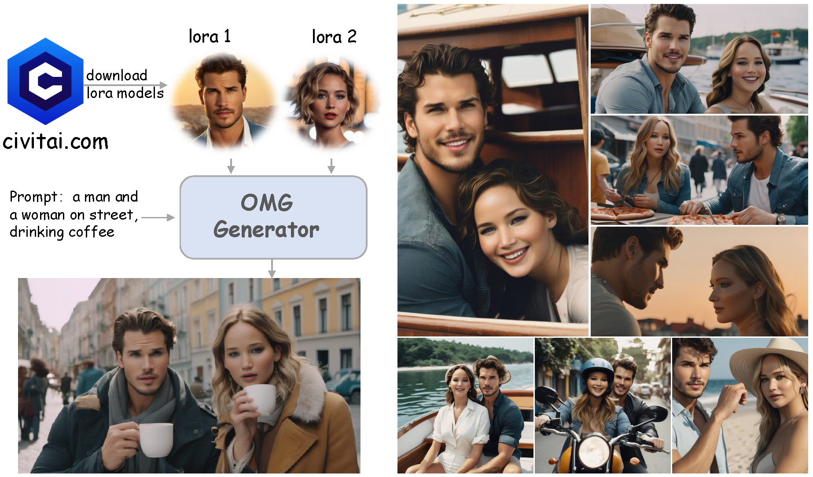
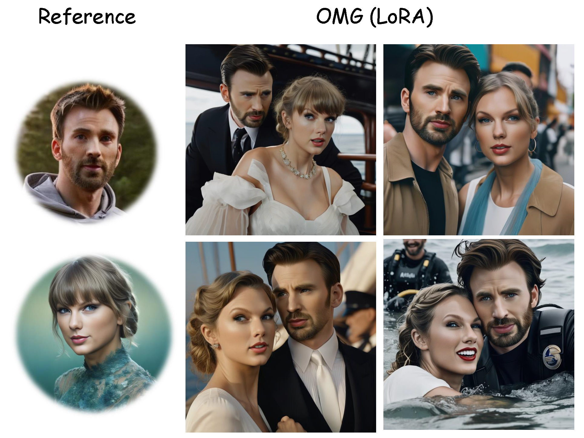
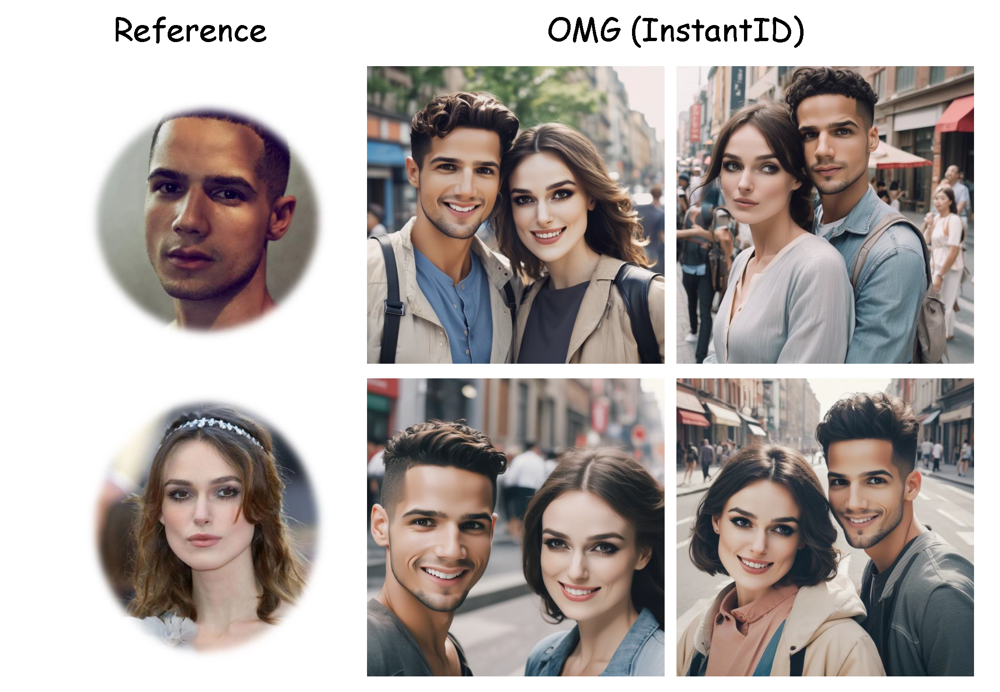
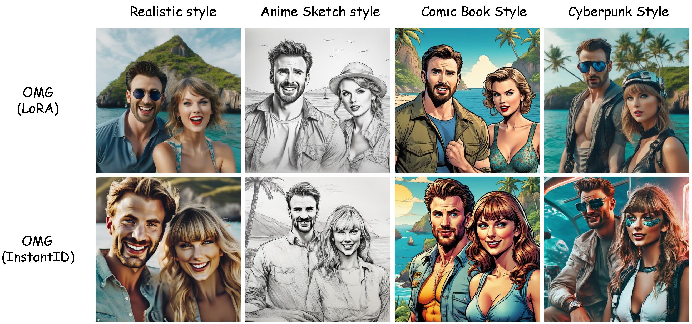

<div align="center">
<h1>OMG: Occlusion-friendly Personalized Multi-concept Generation In Diffusion Models</h1>

[Zhe Kong](https://scholar.google.com/citations?user=4X3yLwsAAAAJ&hl=zh-CN) · [Yong Zhang*](https://yzhang2016.github.io/) · [Tianyu Yang](https://tianyu-yang.com/) · [Tao Wang](https://taowangzj.github.io/)· [Kaihao Zhang](https://zhangkaihao.github.io/)

[Bizhu Wu](https://scholar.google.com/citations?user=u7nZ3bgAAAAJ&hl=zh-CN) · [Guanying Chen](https://guanyingc.github.io/) · [Wei Liu](https://scholar.google.com/citations?user=AjxoEpIAAAAJ&hl=en) ·   [Wenhan Luo*](https://whluo.github.io/)

<sup>*</sup>Corresponding Authors


<a href='https://kongzhecn.github.io/omg-project/'></a>
<a href='xxx'></a>
[](https://github.com/kongzhecn/OMG)

<a href='https://huggingface.co/spaces/xxx'></a>

</div>

> **TL; DR:**  OMG is a framework for multi-concept image generation, supporting character and style LoRAs on [Civitai.com](https://civitai.com/). It also can be combined with [InstantID](https://github.com/InstantID/InstantID) for multiple IDs with using a single image for each ID.    

<p align="center">
  
</p>


> **Trailor Demo:** A short trailor "Home Defense" created by using OMG + SVD.

[](https://www.youtube.com/watch?v=96vi3WFXTe0)


## :label: Change Log 
- [2023/3/18] 🔥 We release the [technical report]().
- [2023/3/18] 🔥 We release the source code and gradio demo of OMG.

## 🔆 Introduction
### 1. OMG + LoRA (ID with multiple images)

<p align="center">
  
</p>

### 2. OMG + InstantID (ID with single image)

<p align="center">
  
</p>

### 3. OMG + ControlNet (Layout Control )

<p align="center">
  
</p>

### 4. OMG + style LoRAs (Style Control)

<p align="center">
  
</p>

## :wrench: Dependencies and Installation


1. The code requires `python==3.10.6`, as well as `pytorch==2.0.1` and `torchvision==0.15.2`. Please follow the instructions [here](https://pytorch.org/get-started/locally/) to install both PyTorch and TorchVision dependencies. Installing both PyTorch and TorchVision with CUDA support is strongly recommended.

```bash
conda create -n OMG python=3.10.6
conda activate OMG
pip install torch==2.0.1 torchvision==0.15.2 torchaudio==2.0.2
pip install -r requirements.txt
pip install git+https://github.com/facebookresearch/segment-anything.git
```

2. For Visual comprehension, you can choose `YoloWorld + EfficientViT SAM` or `GroundingDINO + SAM`

- 1) (Recommend) YoloWorld + EfficientViT SAM:

```bash

pip install inference[yolo-world]==0.9.13
pip install  onnxsim==0.4.35

```

- 2) (Optional) If you can not install `inference[yolo-world]`. You can install `GroundingDINO` for visual comprehension.

`GroundingDINO` requires manual installation. 

Run this so the environment variable will be set under current shell.

```bash

export CUDA_HOME=/path/to/cuda-11.3

```

In this example, `/path/to/cuda-11.3` should be replaced with the path where your CUDA toolkit is installed.

```bash

git clone https://github.com/IDEA-Research/GroundingDINO.git

cd GroundingDINO/

pip install -e .

```

More installation details can be found in [GroundingDINO](https://github.com/IDEA-Research/GroundingDINO#install)

## ⏬ Pretrained Model Preparation

### 1) DownLoad Models

#### 1. Required download:

Download [stable-diffusion-xl-base-1.0](https://huggingface.co/stabilityai/stable-diffusion-xl-base-1.0),
[controlnet-openpose-sdxl-1.0](https://huggingface.co/thibaud/controlnet-openpose-sdxl-1.0).

For `InstantID + OMG` download:
[InstantID](https://huggingface.co/InstantX/InstantID/tree/main), 
[antelopev2](https://drive.google.com/file/d/18wEUfMNohBJ4K3Ly5wpTejPfDzp-8fI8/view?usp=sharing),

#### 2. For Visual comprehension, you can choose "YoloWorld + EfficientViT SAM" or "GroundingDINO + SAM".

For `YoloWorld + EfficientViT SAM`:
[EfficientViT-SAM-XL1](https://github.com/mit-han-lab/efficientvit/blob/master/applications/sam.md), [yolo-world](https://huggingface.co/Fucius/OMG/blob/main/yolo-world.pt).

For `GroundingDINO + SAM`:
[GroundingDINO](https://huggingface.co/ShilongLiu/GroundingDINO), [SAM](https://dl.fbaipublicfiles.com/segment_anything/sam_vit_h_4b8939.pth).

#### 3. For Character LoRAs, download at least one character for man and another character for woman.

For `Character LoRAs for man`:
[Chris Evans](https://civitai.com/models/253793?modelVersionId=286084),
[Harry Potter](https://huggingface.co/Fucius/OMG/blob/main/lora/Harry_Potter.safetensors),
[Jordan Torres](https://civitai.com/models/132387/jordan-torres-15-sdxl?modelVersionId=366964).

For `Character LoRAs for woman`:
[Taylor Swift](https://civitai.com/models/164284/taylor-swift?modelVersionId=185041),
[Hermione Granger](https://huggingface.co/Fucius/OMG/blob/main/lora/Hermione_Granger.safetensors),
[Keira Knightley](https://civitai.com/models/172431/keira-knightley-sdxl?modelVersionId=193658).

#### 4. (Optional) If using ControlNet, download:

[ControlNet](https://huggingface.co/lllyasviel/ControlNet/blob/main/annotator/ckpts/body_pose_model.pth),
[controlnet-canny-sdxl-1.0](https://huggingface.co/diffusers/controlnet-canny-sdxl-1.0),
[controlnet-depth-sdxl-1.0](https://huggingface.co/diffusers/controlnet-depth-sdxl-1.0),
[dpt-hybrid-midas](https://huggingface.co/Intel/dpt-hybrid-midas).

#### 5. (Optional) If using Style LoRAs, download:

[Anime Sketch Style](https://civitai.com/models/202764/anime-sketch-style-sdxl-and-sd15?modelVersionId=258108),
[Oil Painting Style](https://civitai.com/models/336656?modelVersionId=376999),
[Cinematic Photography Style](https://civitai.com/models/214956/cinematic-photography-style-xl).

### 2) Preparation

Put the models under `checkpoint` as follow:
```angular2html
OMG
├── checkpoint
│   ├── antelopev2
│   ├── ControlNet
│   ├── controlnet-openpose-sdxl-1.0
│   ├── controlnet-canny-sdxl-1.0
│   ├── controlnet-depth-sdxl-1.0
│   ├── dpt-hybrid-midas
│   ├── style
│   │   ├── EldritchPaletteKnife.safetensors
│   │   ├── Cinematic Hollywood Film.safetensors
│   │   └── Anime_Sketch_SDXL.safetensors
│   ├── InstantID
│   ├── GroundingDINO
│   ├── lora
│   │   ├── chris-evans.safetensors
│   │   ├── Harry_Potter.safetensors
│   │   ├── Hermione_Granger.safetensors
│   │   ├── jordan_torres_v2_xl.safetensors
│   │   ├── keira_lora_sdxl_v1-000008.safetensors
│   │   ├── lawrence_dh128_v1-step00012000.safetensors
│   │   ├── Gleb-Savchenko_Liam-Hemsworth.safetensors
│   │   └── TaylorSwiftSDXL.safetensors
│   ├── sam
│   │   ├── sam_vit_h_4b8939.pth
│   │   └── xl1.pt
│   └── stable-diffusion-xl-base-1.0
├── gradio_demo
├── src
├── inference_instantid.py
└── inference_lora.py
```


Put `ViT-B-32.pt` (download from [openai]( https://openaipublic.azureedge.net/clip/models/40d365715913c9da98579312b702a82c18be219cc2a73407c4526f58eba950af/ViT-B-32.pt )) to `~/.cache/clip/ViT-B-32.pt`.
If using `YoloWorld`, put `yolo-world.pt` to `/tmp/cache/yolo_world/l/yolo-world.pt`.

Or you can manually set the checkpoint path as follows:

```
python inference_lora.py  \
--pretrained_sdxl_model <path to stable-diffusion-xl-base-1.0> \
--controlnet_checkpoint <path to controlnet-openpose-sdxl-1.0> \
--efficientViT_checkpoint <path to efficientViT-SAM-XL1> \
--dino_checkpoint <path to GroundingDINO> \
--sam_checkpoint <path to sam> \
--lora_path <Lora path to character1|Lora path to character1> \
--style_lora <Path to style LoRA>
```
For OMG + InstantID:
```
python inference_instantid.py  \
--pretrained_model <path to stable-diffusion-xl-base-1.0> \
--controlnet_path <path to InstantID controlnet> \
--face_adapter_path <path to InstantID face adapter> \
--efficientViT_checkpoint <path to efficientViT-SAM-XL1> \
--dino_checkpoint <path to GroundingDINO> \
--sam_checkpoint <path to sam> \
--antelopev2_path <path to antelopev2> \
--style_lora <Path to style LoRA>
```

## :computer: Usage

### 1: OMG + LoRA
The &lt;TOK&gt; for `Harry_Potter.safetensors` is `Harry Potter` and for `Hermione_Granger.safetensors` is `Hermione Granger`.

For visual comprehension, you can set `--segment_type 'yoloworld'` for `YoloWorld + EfficientViT SAM`, or `--segment_type 'GroundingDINO'` for `GroundingDINO + SAM`. 
```
python inference_lora.py \
    --prompt <prompt for the two person> \
    --negative_prompt <negative prompt> \
    --prompt_rewrite "[<prompt for person 1>]-*-[<negative prompt>]|[<prompt for person 2>]-*-[negative prompt]" \
    --lora_path "[<Lora path for character1|Lora path for character1>]"
```
For example:
```
python inference_lora.py \
    --prompt "Close-up photo of the happy smiles on the faces of the cool man and beautiful woman as they leave the island with the treasure, sail back to the vacation beach, and begin their love story, 35mm photograph, film, professional, 4k, highly detailed." \
    --negative_prompt 'noisy, blurry, soft, deformed, ugly' \
    --prompt_rewrite '[Close-up photo of the Chris Evans in surprised expressions as he wear Hogwarts uniform, 35mm photograph, film, professional, 4k, highly detailed.]-*-[noisy, blurry, soft, deformed, ugly]|[Close-up photo of the TaylorSwift in surprised expressions as she wear Hogwarts uniform, 35mm photograph, film, professional, 4k, highly detailed.]-*-[noisy, blurry, soft, deformed, ugly]' \
    --lora_path './checkpoint/lora/chris-evans.safetensors|./checkpoint/lora/TaylorSwiftSDXL.safetensors'
```
For OMG + LoRA + ControlNet:
```
python inference_lora.py \
    --prompt "Close-up photo of the happy smiles on the faces of the cool man and beautiful woman as they leave the island with the treasure, sail back to the vacation beach, and begin their love story, 35mm photograph, film, professional, 4k, highly detailed." \
    --negative_prompt 'noisy, blurry, soft, deformed, ugly' \
    --prompt_rewrite '[Close-up photo of the Chris Evans in surprised expressions as he wear Hogwarts uniform, 35mm photograph, film, professional, 4k, highly detailed.]-*-[noisy, blurry, soft, deformed, ugly]|[Close-up photo of the TaylorSwift in surprised expressions as she wear Hogwarts uniform, 35mm photograph, film, professional, 4k, highly detailed.]-*-[noisy, blurry, soft, deformed, ugly]' \
    --lora_path './checkpoint/lora/chris-evans.safetensors|./checkpoint/lora/TaylorSwiftSDXL.safetensors' \
    --spatial_condition './example/pose.png' \
    --controlnet_checkpoint './checkpoint/controlnet-openpose-sdxl-1.0'
```

For OMG + LoRA + Style:
```
python inference_lora.py \
    --prompt "Close-up photo of the happy smiles on the faces of the cool man and beautiful woman as they leave the island with the treasure, sail back to the vacation beach, and begin their love story, 35mm photograph, film, professional, 4k, highly detailed, Pencil_Sketch:1.2, messy lines, greyscale, traditional media, sketch." \
    --negative_prompt 'noisy, blurry, soft, deformed, ugly' \
    --prompt_rewrite '[Close-up photo of the Chris Evans in surprised expressions as he wear Hogwarts uniform, 35mm photograph, film, professional, 4k, highly detailed, Pencil_Sketch:1.2, messy lines, greyscale, traditional media, sketch.]-*-[noisy, blurry, soft, deformed, ugly]|[Close-up photo of the TaylorSwift in surprised expressions as she wear Hogwarts uniform, 35mm photograph, film, professional, 4k, highly detailed, Pencil_Sketch:1.2, messy lines, greyscale, traditional media, sketch.]-*-[noisy, blurry, soft, deformed, ugly]' \
    --lora_path './checkpoint/lora/chris-evans.safetensors|./checkpoint/lora/TaylorSwiftSDXL.safetensors' \
    --style_lora './checkpoint/style/Anime_Sketch_SDXL.safetensors' 
```

### 2: OMG + InstantID

```
python inference_instantid.py \
    --prompt <prompt for the two person> \
    --negative_prompt <negative prompt> \
    --prompt_rewrite "[<prompt for person 1>]-*-[<negative prompt>]-*-<path to reference image1>|[<prompt for person 2>]-*-[negative prompt]-*-<path to reference image2>"
```
For example:
```
python inference_instantid.py \
    --prompt 'Close-up photo of the happy smiles on the faces of the cool man and beautiful woman as they leave the island with the treasure, sail back to the vacation beach, and begin their love story, 35mm photograph, film, professional, 4k, highly detailed.' \
    --negative_prompt 'noisy, blurry, soft, deformed, ugly' \
    --prompt_rewrite '[Close-up photo of the a man, 35mm photograph, professional, 4k, highly detailed.]-*-[noisy, blurry, soft, deformed, ugly]-*-./example/chris-evans.jpg|[Close-up photo of the a woman, 35mm photograph, professional, 4k, highly detailed.]-*-[noisy, blurry, soft, deformed, ugly]-*-./example/TaylorSwift.png'
```

### 3. Local gradio demo with OMG + LoRA
If you choose `YoloWorld + EfficientViT SAM`:
```
python gradio_demo/app.py --segment_type yoloworld
```
For `GroundingDINO + SAM`:
```
python gradio_demo/app.py --segment_type GroundingDINO
```
Connect to the public URL displayed after the startup process is completed.
